# Dev-Event → Discord Forum Sync

`brave-people/Dev-Event`의 `README.md`를 읽어 새 이벤트만 디스코드 포럼 채널에 자동 게시합니다.

## 아키텍처

```mermaid
flowchart LR
    A["GitHub Actions<br/>20분마다 실행"] --> B["Dev-Event README Fetch"]
    B --> C["README Parser<br/>현재 행사만 추출"]
    C --> D["URL Canonicalize + Dedup"]
    D --> E["State Load<br/>automation-state/state.json"]
    E --> F["새 이벤트 선별<br/>첫 실행은 이번 달만"]
    F --> G["행사 페이지 메타 수집<br/>og:image / twitter:image"]
    G --> H["Gemini 요약 생성<br/>실패 시 fallback"]
    H --> I["모집중 / 모집종료 태그 계산"]
    I --> J["Discord Forum Webhook 게시"]
    J --> K["state.json 갱신 후<br/>automation-state 브랜치 push"]
```



## 동작 방식

- 현재 행사 목록만 파싱합니다.
- 첫 실행에서는 현재 월 섹션만 게시합니다.
- 이후에는 새로 등장한 이벤트만 게시합니다.
- 행사 대표 이미지는 `og:image` 또는 `twitter:image`에서 가져옵니다.
- Gemini 요약이 실패하면 고정 템플릿 텍스트를 사용합니다.
- 포럼 태그는 `모집중`, `모집종료`만 사용합니다.

## 내가 해야 할 일

1. GitHub에 이 프로젝트를 새 저장소로 올립니다.
2. 디스코드 포럼 채널에 태그 2개를 만듭니다.
   - `모집중`
   - `모집종료`
3. 포럼 채널용 웹훅 URL을 생성합니다.
4. GitHub 저장소 `Settings > Secrets and variables > Actions`에 아래 Secrets를 추가합니다.
5. `Actions` 탭에서 `Dev Event to Discord` 워크플로를 수동 실행합니다.
6. 첫 실행에서 이번 달 이벤트만 포럼에 올라오는지 확인합니다.

## 필요한 Secrets

- `DISCORD_WEBHOOK_URL`
- `DISCORD_TAG_ID_OPEN`
- `DISCORD_TAG_ID_CLOSED`
- `GEMINI_API_KEY`

선택 환경 변수:

- `README_URL`
- `TIMEZONE_NAME` 기본값 `Asia/Seoul`
- `SOURCE_README_PAGE_URL`

## 포럼 준비

- 디스코드 포럼 채널에 태그 `모집중`, `모집종료`를 먼저 생성해야 합니다.
- GitHub Secret `DISCORD_TAG_ID_OPEN`에는 `모집중` 태그 ID를 넣습니다.
- GitHub Secret `DISCORD_TAG_ID_CLOSED`에는 `모집종료` 태그 ID를 넣습니다.
- 웹훅은 반드시 해당 포럼 채널에 연결된 웹훅이어야 합니다.

## 로컬 실행

```bash
python3 -m venv .venv
source .venv/bin/activate
pip install -r requirements.txt
python -m src.main --dry-run
```

실제 전송 테스트:

```bash
export DISCORD_WEBHOOK_URL="..."
export DISCORD_TAG_ID_OPEN="..."
export DISCORD_TAG_ID_CLOSED="..."
export GEMINI_API_KEY="..."
python -m src.main
```

## 상태 저장

워크플로는 `automation-state` 브랜치의 `state.json`을 읽고 갱신합니다.

```text
main branch
└─ 코드, 테스트, 워크플로

automation-state branch
└─ state.json
```

## 게시 규칙 요약

- 수정된 이벤트는 다시 게시하지 않습니다.
- 같은 이벤트는 URL 정규화 후 한 번만 게시합니다.
- 대표 이미지가 없으면 이미지 없이 게시합니다.
- Gemini 실패 시 템플릿 요약으로 대체합니다.
- `접수:`가 있으면 마감일 기준 태그를 붙입니다.
- `일시:`만 있으면 행사 종료 전 `모집중`, 이후 `모집종료`를 붙입니다.
