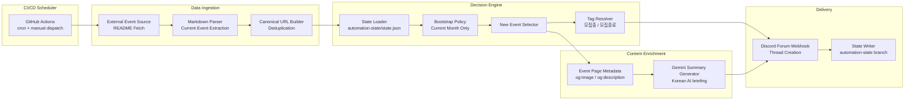

# Dev-Event in Discord Webhook

<p align="center">
  외부 행사 데이터를 자동 수집해 디스코드 포럼 채널에 발행하는 이벤트 알림 파이프라인
</p>

<p align="center">
  
  
  
  
  
</p>

## Overview

이 프로젝트는 외부 행사 목록을 주기적으로 읽어 새 이벤트만 선별하고, 디스코드 포럼 채널에 자동으로 게시하는 서버리스 자동화 시스템입니다.

게시되는 포럼 글에는 다음 정보가 포함됩니다.

- 행사 대표 이미지: `og:image` 또는 `twitter:image`
- 생성형 AI 요약: Gemini 기반 한국어 안내형 요약
- 핵심 메타데이터: 주최, 분류, 접수/일시, 원문 링크
- 포럼 태그: `모집중` 또는 `모집종료`

## Key Features

- GitHub Actions 기반 스케줄 실행
- URL 정규화 기반 중복 제거
- 첫 실행 시 현재 월 이벤트만 백필
- 이후 실행부터는 신규 이벤트만 발행
- 행사 페이지 메타 태그 기반 대표 이미지 수집
- Gemini 실패 시 템플릿 문구로 안전하게 fallback
- `automation-state` 브랜치에 상태를 영구 저장

## Architecture



## Runtime Flow

1. GitHub Actions가 20분마다 워크플로를 실행합니다.
2. 외부 행사 목록을 가져와 현재 행사 구간만 파싱합니다.
3. URL을 정규화해 중복 이벤트를 제거합니다.
4. `automation-state` 브랜치의 `state.json`을 읽어 이전에 게시한 이벤트를 불러옵니다.
5. 첫 실행이면 현재 월 섹션만 게시 대상으로 선택합니다.
6. 신규 이벤트만 메타데이터 수집, AI 요약, 태그 계산을 수행합니다.
7. 디스코드 포럼 웹훅으로 새 스레드를 생성합니다.
8. 성공한 이벤트만 상태 파일에 반영하고 `automation-state` 브랜치에 저장합니다.

## Tech Stack

| Layer | Technology | Purpose |
| --- | --- | --- |
| Runtime | Python 3.12 | 파싱, URL 정규화, 메타 수집, 디스코드 전송 |
| Scheduler | GitHub Actions | 주기 실행과 수동 실행 |
| Delivery | Discord Webhook | 포럼 글 자동 생성 |
| AI | Gemini API | 행사 소개 문구 요약 |
| State | Git branch (`automation-state`) | 게시 이력 저장 |

## Project Structure

```text
.
├── .github/workflows/dev-event-to-discord.yml
├── src/
│   ├── config.py
│   ├── discord_webhook.py
│   ├── event_meta_fetcher.py
│   ├── gemini_client.py
│   ├── identity.py
│   ├── main.py
│   ├── models.py
│   ├── readme_fetcher.py
│   ├── readme_parser.py
│   ├── state_store.py
│   └── tag_policy.py
└── tests/
```

## Posting Policy

- 현재 행사 목록만 대상으로 합니다.
- 첫 실행은 현재 월 섹션만 게시합니다.
- 이후에는 새로 등장한 이벤트만 게시합니다.
- 이미 게시된 이벤트는 제목이나 일정이 바뀌어도 다시 올리지 않습니다.
- 이미지가 없으면 텍스트와 임베드만 게시합니다.
- `접수:`가 있으면 마감일 기준으로 태그를 계산합니다.
- `일시:`만 있으면 행사 종료 전 `모집중`, 종료 후 `모집종료`를 사용합니다.

## Deployment Checklist

### 1. Discord Forum Setup

- 포럼 채널에 아래 태그를 생성합니다.
  - `모집중`
  - `모집종료`
- 반드시 해당 포럼 채널용 웹훅을 생성합니다.

### 2. GitHub Secrets

저장소의 `Settings > Secrets and variables > Actions`에서 아래 값을 추가합니다.

| Secret | Description |
| --- | --- |
| `DISCORD_WEBHOOK_URL` | 디스코드 포럼 웹훅 URL |
| `DISCORD_TAG_ID_OPEN` | `모집중` 태그 ID |
| `DISCORD_TAG_ID_CLOSED` | `모집종료` 태그 ID |
| `GEMINI_API_KEY` | Gemini API Key |

선택 환경 변수:

| Variable | Default |
| --- | --- |
| `README_URL` | 외부 README 원본 URL |
| `SOURCE_README_PAGE_URL` | GitHub README 페이지 URL |
| `TIMEZONE_NAME` | `Asia/Seoul` |
| `GEMINI_MODEL` | `gemini-2.0-flash` |

### 3. GitHub Actions Run

1. 저장소 상단의 `Actions` 탭으로 이동합니다.
2. `Dev Event to Discord` 워크플로를 선택합니다.
3. `Run workflow`를 눌러 수동 실행합니다.
4. 첫 실행에서 현재 월 이벤트만 포럼에 생성되는지 확인합니다.

## Local Development

### Install

```bash
python3 -m venv .venv
source .venv/bin/activate
pip install -r requirements.txt
```

### Dry Run

```bash
python -m src.main --dry-run
```

### Live Run

```bash
export DISCORD_WEBHOOK_URL="..."
export DISCORD_TAG_ID_OPEN="..."
export DISCORD_TAG_ID_CLOSED="..."
export GEMINI_API_KEY="..."
python -m src.main
```

## State Management

운영 상태는 `automation-state` 브랜치의 `state.json`으로 관리합니다.

```text
main
└── application code + tests + workflow

automation-state
└── state.json
```

상태에는 다음 정보가 저장됩니다.

- 게시된 이벤트 식별자
- 정규화된 URL
- 원본 제목
- 게시 시각
- 디스코드 스레드 ID
- 디스코드 메시지 ID
- 적용 태그

## Testing

```bash
pytest -q
```

포함된 테스트 범위:

- README 파싱
- URL 정규화 및 중복 제거
- 모집 태그 계산
- 메타데이터 추출
- 디스코드 payload 생성
- 첫 실행 bootstrap 정책

## Troubleshooting

### Discord 403 Forbidden

- 포럼 채널용 웹훅인지 확인합니다.
- `DISCORD_WEBHOOK_URL`이 최신 웹훅인지 확인합니다.
- 태그 ID가 실제 포럼 채널의 `available_tags.id`와 일치하는지 확인합니다.
- 워크플로가 최신 `main` 커밋으로 실행되었는지 확인합니다.

### 일부 행사 페이지에서 이미지가 없을 때

- 일부 사이트는 외부 크롤링을 `401/403`으로 막습니다.
- 이 경우 이미지는 생략되며, 게시는 계속 진행됩니다.

### Gemini가 실패할 때

- API Key 설정 여부를 확인합니다.
- 실패 시 템플릿 문구로 자동 fallback 됩니다.

## Notes

- 웹훅 URL은 민감 정보이므로 외부에 노출되면 즉시 재발급해야 합니다.
- 이 시스템은 기존 게시글을 수정하지 않고, 신규 이벤트만 발행합니다.
